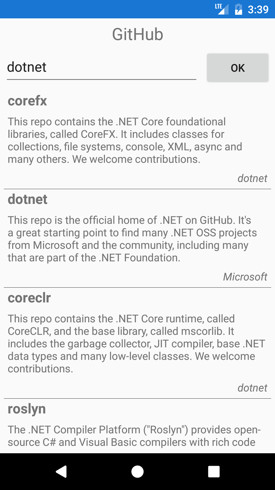

# GitHub App #

Simple mobile application to search GitHub repositories.

Works in Android and iOS devices. It is implemented in C# using [Xamarin.Forms](https://www.xamarin.com/forms) cross-platform framework following the Model-View-ViewModel ([MVVM](https://en.wikipedia.org/wiki/Model_View_ViewModel)) design pattern to decouple the UI from the model.

#### Screenshot ####

  

